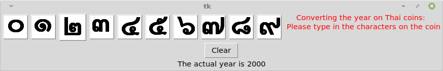

# Thai_years_converter
This program is very useful (especially for coin collectors), as you just type in the Thai characters you can see on the coins, and the program will automatically convert them to the more familiar format (e.g. 2019)

